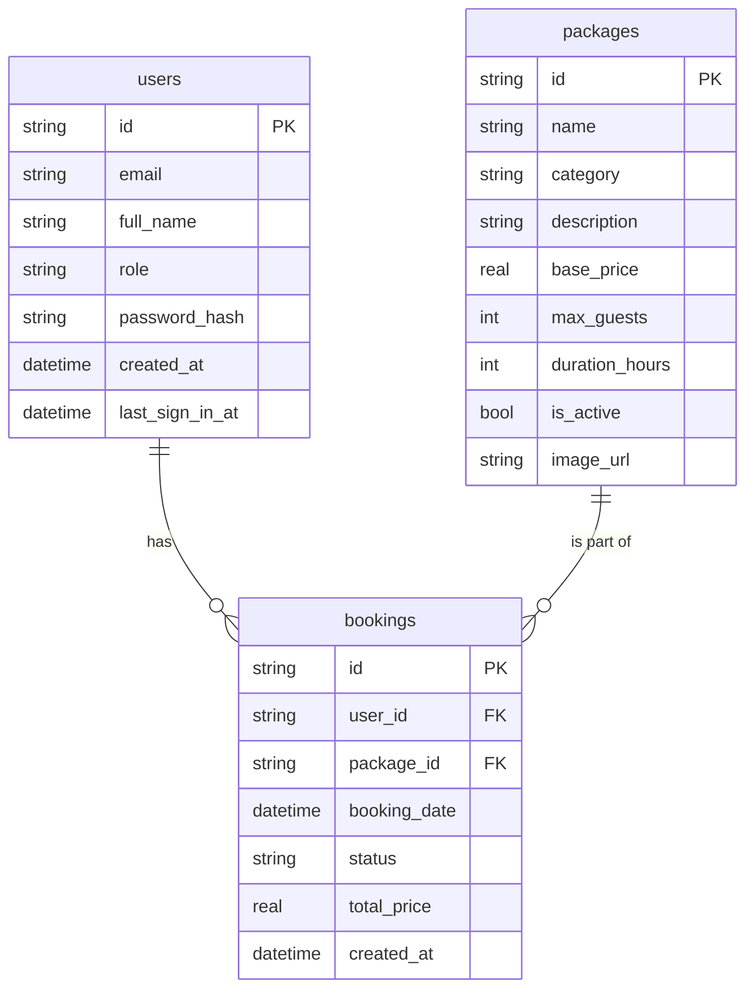
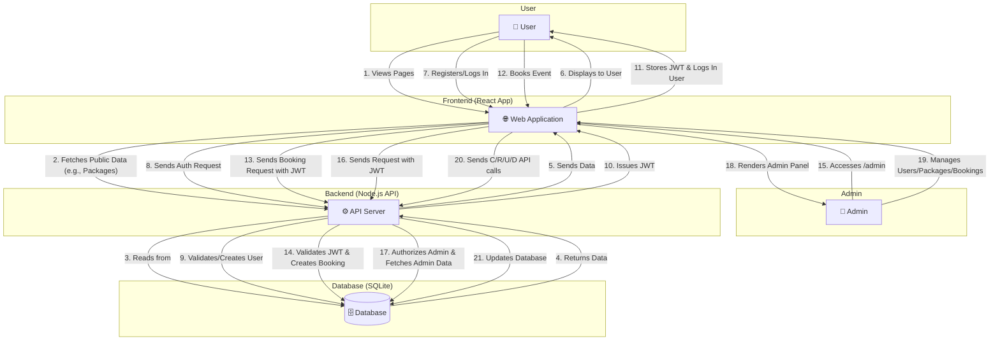

# Grand Elegance Hall - Event Management System

Welcome to the Grand Elegance Hall project! This is a full-featured web application for managing bookings and packages for an event hall. It includes a beautiful, user-facing website for browsing and booking, as well as a comprehensive admin panel for managing users, packages, and bookings.

## ✨ Features

- **Modern Frontend:** A stunning, responsive user interface built with React and Tailwind CSS.
- **Admin Dashboard:** A secure, role-protected admin panel for complete management of the platform.
- **Package Management:** Admins can create, read, update, and delete event packages, including image uploads.
- **User Management:** Admins can view and manage registered users.
- **Booking System:** Authenticated users can book event packages, and admins can manage all bookings.
- **Custom Backend:** A robust backend built with Node.js, Express.js, and a lightweight SQLite database.
- **Smooth Navigation:** Seamless scrolling for on-page sections.

---

## 💻 Technology Stack

The project is built with a modern, full-stack JavaScript architecture.

- **Frontend:**
  - **Framework:** [React](https://reactjs.org/) with [Vite](https://vitejs.dev/)
  - **Language:** [TypeScript](https://www.typescriptlang.org/)
  - **Styling:** [Tailwind CSS](https://tailwindcss.com/)
  - **UI Components:** [shadcn/ui](https://ui.shadcn.com/) & [sonner](https://sonner.emilkowal.ski/) for notifications.
  - **Routing:** [React Router](https://reactrouter.com/)

- **Backend:**
  - **Framework:** [Node.js](https://nodejs.org/) with [Express.js](https://expressjs.com/)
  - **Language:** [TypeScript](https://www.typescriptlang.org/)
  - **Database:** [SQLite](https://www.sqlite.org/index.html)
  - **Authentication:** JWT (JSON Web Tokens)

---

## 🚀 Getting Started

To get the project up and running on your local machine, follow these steps.

### 1. Backend Setup

First, navigate to the backend directory and install the dependencies.

```bash
cd backend
npm install
```

Then, run the development server. This will also create the `event-hall.db` database file on its first run.

```bash
npm run dev
```

The backend server will start on `http://localhost:3000`.

### 2. Frontend Setup

In a separate terminal, navigate to the project's root directory and install the frontend dependencies.

```bash
npm install
```

Then, run the development server.

```bash
npm run dev
```

The frontend application will be available at `http://localhost:8080` (or another port if 8080 is in use).

### 3. Creating an Admin User

To access the admin panel, you need an admin account.

1.  **Register a new user** through the application's UI.
2.  **Manually update the user's role.** You will need a database tool like [DB Browser for SQLite](https://sqlitebrowser.org/).
    -   Open the database file located at `backend/db/event-hall.db`.
    -   Run the following SQL query, replacing the email with your registered user's email:
        ```sql
        UPDATE users SET role = 'admin' WHERE email = 'your-email@example.com';
        ```
3.  **Log in** with the newly promoted admin account and navigate to `/admin`.

---

## 📊 System Diagrams

### Entity Relationship Diagram (ERD)

This diagram shows the relationships between the main entities in the database.



### Data Flow Diagram (DFD)

This diagram illustrates the high-level flow of data within the system.


